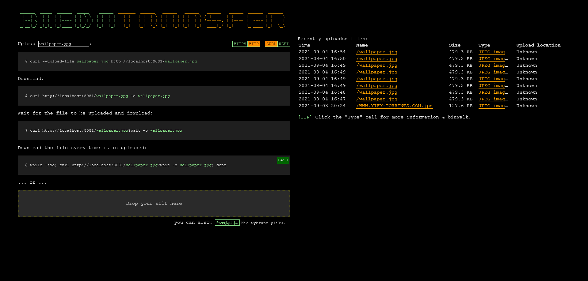
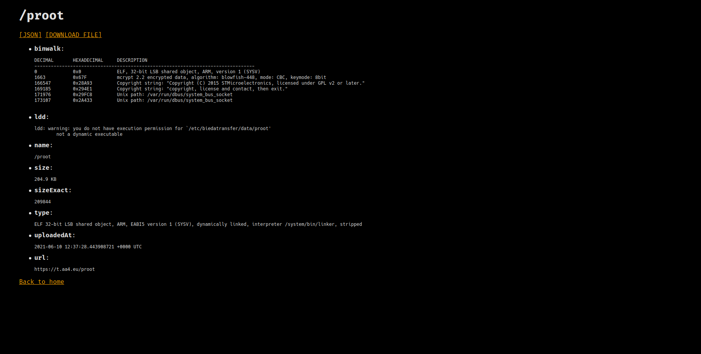

# biedatransfer

An easy to use and simple file transfer website built in Golang.



It allows for file upload using the web interface (drag and drop) or via `curl`


It also parses the uploaded files using `binwalk`, `file` and `ldd` and displays the data on a separate page.



## Usage

Place a `biedatransfer-config.yaml` file in the working directory or in `/etc/biedatransfer`. Example contents:

You will also need a IP2LOCATION file for the resolution of upload locations via ip.

```
http:
  addr: :8080
  mode: debug
  trustedproxies:
  - 127.0.0.0/24
  url: https://t.aa4.eu
upload:
  datadir: /etc/biedatransfer/data
  forbiddennames:
  - index.html
  - index.htm
  - robots.txt
  - humans.txt
  - favicon.ico
  - wp-admin.php
  - xmlrpc.php
  - .env
  - .git
  - .config
  - recents.json
  - .
  - /
  - ./
  - style.css
  locationdatabasepath: /etc/biedatransfer/IP2LOCATION-LITE-DB5.BIN
  recentssize: 40
```
